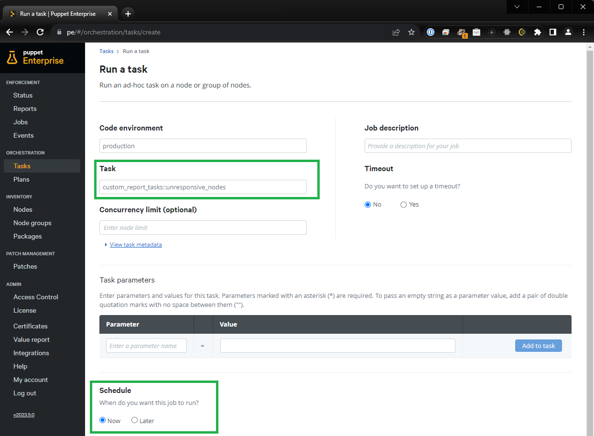

# custom_report_tasks

A set of Puppet Tasks for custom Puppet Enterprise reports using the PuppetDB APIs

## custom_report_tasks::unresponsive_nodes

This Puppet Task supports the Puppet Enterprise Orchestrator (when installed as a Puppet module in the environment) or can be run from the command line utility Puppet Bolt.

To schedule a periodic run of this task with Puppet Enterprise, the Puppet Orchestrator Scheduled Tasks feature can be used.
To schedule a periodic run of thie task with Puppet Bolt, a "cron" job (Linux) or task within the "Task Scheduler" (Windows) can be used.

### Usage: 

#### Task Parameters

```
[user@workstation custom_report_tasks]$ bolt task show custom_report_tasks::unresponsive_nodes

custom_report_tasks::unresponsive_nodes
  Custom Report Tasks - Report on unresponsive nodes.

Usage
  bolt task run custom_report_tasks::unresponsive_nodes --targets <targets>
  [debug=<value>] [email_address=<value>] [local_file=<value>]
  [puppetdb_uri=<value>] [return_fields=<value>] [token=<value>]
  [token_location=<value>]

Parameters
  debug  Boolean
    Show debugging information. WARNING: This will expose your authoriation token
    visibily!
    Default: false

  email_address  Optional[String[1]]
    Email address to send the report to. Note: assumes a Linux system is used to run
    this task and requires "sendmail" to be previously configured.

  local_file  String[1]
    Local file in which to save the report. This file will reside on the target node
    this task is run against. The file will be overwritten on each run of this task
    without warning.
    Default: "/tmp/unresponsive_nodes.json"

  puppetdb_uri  String[1]
    PuppetDB server URI for Reports API endpoint access.
    Default: "https://localhost:8081"

  return_fields  String[1]
    Fields to return from reports endpoint for each node in the report.
    Default: "certname,receive_time,corrective_change,status"

  token  String[1]
    Token used for PuppetDB API authorizated access. If defined as 'local'
    (default), an attempt will be made to use the content of an existing token
    located 'token_location', otherwise this parameter is expected to contain the
    token content itself.
    Default: "local"

  token_location  String[1]
    Provide an alternate location for the token file, if using a local file
    containing the access token.
    Default: "/root/.puppetlabs/token"
```

#### To generate a report using Puppet Bolt, run the following command:

`bolt task run custom_report_tasks::unresponsive_nodes -t <target_host>`

Note: The target host can be any host that has a puppet agent installed. A Puppet Enterprise access token will need to be made available to the task. 
If the token is not provided as a parameter, the task will attempt to use the content of an existing token file located at `/root/.puppetlabs/token`.
See the task parameters to see how to define a custom token file location or provide the token directly.

#### To list additional supported task parameters, run the following command:

`bolt task show custom_report_tasks::unresponsive_nodes`

#### Generating a Puppet Access Token

A Puppet Enterprise access token can be generated using the `puppet access login` command on the Primary Puppet command line, or through the Puppet Enterprise Console UI.

Documentation for creating a access token can be found in the Puppet Enterprise documentation here: [Token-based authentication](https://www.puppet.com/docs/pe/2023.5/rbac_token_auth_intro.html)

Note: It is advised to use a longer `lifetime` than the default for the acess token to prevent expiry, especially when automating as a scheduled task.

### Puppet Bolt Examples:

#### Installation for use with Bolt:

A simple installation and setup to use the task from Puppet Bolt.
Note: This example assumes that Puppet `bolt` and `git` command line tools are installed on the local workstation.
See [Bolt installation Instructions](https://www.puppet.com/docs/bolt/latest/bolt_installing.html) if needed.

```
[user@workstation ~]$ mkdir my_working_dir
[user@workstation ~]$ cd my_working_dir
[user@workstation my_working_dir]$ git clone https://github.com/psreed/custom_report_tasks.git

Cloning into 'custom_report_tasks'...
remote: Enumerating objects: 31, done.
remote: Counting objects: 100% (31/31), done.
remote: Compressing objects: 100% (22/22), done.
remote: Total 31 (delta 2), reused 31 (delta 2), pack-reused 0
Receiving objects: 100% (31/31), 13.20 KiB | 422.00 KiB/s, done.
Resolving deltas: 100% (2/2), done.

[user@workstation my_working_dir]$ cd custom_report_tasks

[user@workstation custom_report_tasks]$
```

#### Running against the local workstation:

Note: This example assumes a valid token file exists on the local workstation in `~/.puppetlabs/token`

```
[user@workstation custom_report_tasks]$ bolt task run custom_report_tasks::unresponsive_nodes -t localhost token=$(cat ~/.puppetlabs/token) puppetdb_url="https://pe.paulreed.ca:8081"

Started on localhost...
Finished on localhost:
  
  [
    {
      "description": "Nodes unresponsive more than 1 hr, but less than 1 day",
      "time_bewteen": "2023-11-20 19:43:42 and 2023-11-21 18:43:42",
      "time_now": "2023-11-21 19:43:42",
      "nodes": [
        {
          "certname": "go.paulreed.ca",
          "receive_time": "2023-11-21T04:07:59.986Z",
          "corrective_change": false,
          "status": "unchanged"
        }
      ]
    },
    {
      "description": "Nodes unresponsive more than 1 day, but less than 7 days",
      "time_bewteen": "2023-11-14 19:43:42 and 2023-11-20 19:43:42",
      "time_now": "2023-11-21 19:43:42",
      "nodes": [
        {
          "certname": "docker01.paulreed.ca",
          "receive_time": "2023-11-20T16:43:43.381Z",
          "corrective_change": false,
          "status": "unchanged"
        }
      ]
    },
    {
      "description": "Nodes unresponsive more than 7 days, but less than 12 days",
      "time_bewteen": "2023-11-09 19:43:42 and 2023-11-14 19:43:42",
      "time_now": "2023-11-21 19:43:42",
      "nodes": [
  
      ]
    },
    {
      "description": "Nodes unresponsive more than 12 days",
      "time_bewteen": "2023-11-21 19:43:42 and 2023-11-09 19:43:42",
      "time_now": "2023-11-21 19:43:42",
      "nodes": [
  
      ]
    }
  ]
  
Successful on 1 target: localhost
Ran on 1 target in 1.26 sec
```

#### Running remotely against the Puppet Enterprsie Server directly

Running against a remote Puppet Enterprise host.
This exmample assumes a valid `token` located at `/root/.puppetlabs/token` on the Puppet Server.
This example also assumes a valid SSH key is configured to access the Puppet Server from the local user.
You can also provide the `--user`, `--password-prompt` and `--sudo-password-prompt` options to `bolt`. See the `bolt task run --help` documentation for information on these options.

```
[user@workstation custom_report_tasks]$ bolt task run custom_report_tasks::unresponsive_nodes -t pe.paulreed.ca

Started on pe.paulreed.ca...
Finished on pe.paulreed.ca:
  
  [
    {
      "description": "Nodes unresponsive more than 1 hr, but less than 1 day",
      "time_bewteen": "2023-11-20 19:42:27 and 2023-11-21 18:42:27",
      "time_now": "2023-11-21 19:42:27",
      "nodes": [
        {
          "certname": "go.paulreed.ca",
          "receive_time": "2023-11-21T04:07:59.986Z",
          "corrective_change": false,
          "status": "unchanged"
        }
      ]
    },
    {
      "description": "Nodes unresponsive more than 1 day, but less than 7 days",
      "time_bewteen": "2023-11-14 19:43:42 and 2023-11-20 19:43:42",
      "time_now": "2023-11-21 19:43:42",
      "nodes": [
        {
          "certname": "docker01.paulreed.ca",
          "receive_time": "2023-11-20T16:43:43.381Z",
          "corrective_change": false,
          "status": "unchanged"
        }
      ]
    },
 ...
 ```

#### Selecting specific return fields:

The following example returns only the `certname` field for each node in the reports.

```
[user@workstation custom_report_tasks]$ bolt task run custom_report_tasks::unresponsive_nodes -t localhost return_fields='certname'

Started on localhost...
Finished on localhost:
  
  [
    {
      "description": "Nodes unresponsive more than 1 hr, but less than 1 day",
      "time_bewteen": "2023-11-20 19:42:27 and 2023-11-21 18:42:27",
      "time_now": "2023-11-21 19:42:27",
      "nodes": [
        {
          "certname": "go.paulreed.ca"
        }
      ]
    },
    {
      "description": "Nodes unresponsive more than 1 day, but less than 7 days",
      "time_bewteen": "2023-11-14 19:42:27 and 2023-11-20 19:42:27",
      "time_now": "2023-11-21 19:42:27",
      "nodes": [
        {
          "certname": "docker01.paulreed.ca"
        }
      ]
    },
 ...
```

### Puppet Enterprise Examples:

#### Module Installation:

To make the task available in your Puppet Enterprise Orchestrator, add the following lines to your `Puppetfile` inside your control repository.

```
## Custom Report Tasks
mod 'psreed-custom_report_tasks',
  :git    => 'https://github.com/psreed/custom_report_tasks.git',
  :branch => 'main'
```

#### Task usage from Puppet Enterprsie

Once the module is installed, the task should be available to run or schedule from the Console UI. To see the additional parameters for the task, use the `View task metadata` link to expose the view. 
For additional information on using Tasks with Puppet Enterprise, see [Tasks in PE](https://www.puppet.com/docs/pe/2023.5/tasks_in_pe.html)



Note: At minimum, the `token` and `puppetdb_url` parameters will likely need to be set.


Select only a single node from which to run the report. Any endpoint that has a Puppet Agent installed should be able to run the report. This can be your primary Puppet Server or any other node, as long as a `token_location` file exists on that node or `token` is provided as a parameter. You may also need to specify the `puppetdb_url`.


